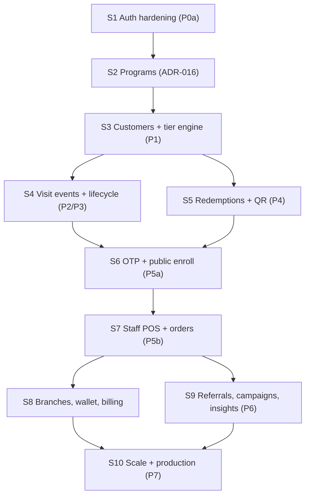

# Loyollo Backend — Sprint Plan

> Execution plan for the `loyollo-backend` NestJS program. Ten one-week sprints, ordered by the
> dependency chain fixed in the contracts. Build them **in order** — each sprint assumes the ones
> before it are done.

## 1. How to use this plan

**Sources of truth (never contradict them):**

| Source | Governs |
| --- | --- |
| `loyollo-web/docs/backend/data-contract.md` | Schema, constraints, enums, DB functions, write rules |
| `loyollo-web/docs/backend/api-contract.md` | Endpoints, error envelope, error codes, JWT claims |
| `loyollo-web/docs/backend/remediation-roadmap.md` | Phase ladder P0a → P7, acceptance criteria |
| `loyollo-web/docs/backend/customer-lifecycle.md` | G-08 lifecycle states |
| `loyollo-web/docs/product/*.md` | PM-xx / UX-xx / DG-xx business rules, Ship 1 scope |
| ADRs 005, 011, 012, 013, 014, 015, 016, 017 | Auth, storage, rate limits, messaging, ownership, stack, programs, CSRF |

**Rule IDs used below:** PM-xx = product lock, UX-xx = UX lock, G-xx = gap backlog item,
DG-xx = design gap. When a story cites one, the linked doc text wins over this plan.

**Stack lock (ADR-015):** NestJS 11.x, Prisma 7.x (+`@prisma/adapter-pg`), PostgreSQL 18.x,
Node 24 LTS. No pre-release majors.

**Ownership (ADR-014):** all schema and migrations live in this repo. Never ask the frontend
repo to migrate product data.

## 2. Current state (starting point)

Already implemented (commit history 2026-08-19):

- Auth module: `POST /auth/sign-up`, `sign-in`, `refresh`, `sign-out`, `forgot-password`,
  `reset-password`, `change-password`; `GET /auth/me`. Access JWT 15m, refresh 7d (hashed at rest).
- Schema: `profiles` (role `admin|staff|customer`, account_status `active|inactive|pending`),
  `refresh_tokens`, `password_reset_tokens`.
- `GET /health`, Docker Postgres 18.6, global `ValidationPipe`, seed for D-28 test admin.

Known gaps closed in Sprint 1: no refresh rotation, mailer is a log-only stub, no tests,
no team/account-status endpoints, JWT missing `owner_id`/`email` claims, no role guard.

Everything else — the entire loyalty domain — is unbuilt.

## 3. Dependency graph

Hard rules behind the arrows: OTP must exist before POS can see members (P5 note in roadmap);
reserve/QR model before any concurrent redeem; snapshot at create before scan correctness;
PM-08 two counters before any tier display.

## 4. Sprint overview

| Sprint | Phase | Theme | Ship 1 blocker? |
| --- | --- | --- | --- |
| 1 | P0a | Auth hardening + platform | Yes |
| 2 | — | Programs domain (ADR-016) | Yes |
| 3 | P1 | Customers, memberships, tier engine | Yes |
| 4 | P2/P3 | Visit events, lifecycle, analytics read | Partial (metrics honesty) |
| 5 | P4 | Rewards catalog + redemption state machine | Yes |
| 6 | P5a | OTP (PM-06) + public enroll (UX-75) | Yes |
| 7 | P5b | Staff POS + orders + ROI | Yes |
| 8 | — | Branches, vouchers, wallet read, billing stubs | Partial |
| 9 | P6 | Referrals, campaigns, insights, search | No (post-Ship 1) |
| 10 | P7 | Scale, production hardening | No |

## 5. Sprint details

---

### Sprint 1 — Auth hardening + P0a completion

**Goal:** make the existing auth module production-grade and contract-complete.
**Why now:** every later sprint's endpoints sit behind these guards; the Next.js D-28 cookie/SSR
proof depends on this contract.
**Contract refs:** api-contract (auth/session), ADR-005 Option C, ADR-017, remediation P0a.

#### US-1.1 Refresh-token rotation

As a merchant, I want my refresh token rotated on every use so that a stolen token is detected and killed.

- [ ] Rotate: `POST /auth/refresh` issues a **new** refresh token and revokes the presented one
- [ ] Reuse detection: presented hash unknown/revoked → revoke all user refresh tokens, 401
- [ ] Re-read `role` + `account_status` from DB on every refresh (never trust old claims)
- [ ] Tests: happy path, reuse attack, inactive user blocked

Acceptance: refresh response contains fresh access + refresh; old refresh token rejected afterward.

#### US-1.2 Team + account-status administration

As an admin, I want to add teammates and toggle account status so that I control shop access.

- [ ] `POST /auth/team` — creates teammate with `account_status=pending`, emails temp password
- [ ] `PATCH /auth/accounts/:id/status` — admin-only; only `staff`/`customer` targets; `active|inactive`
- [ ] `change-password` on a `pending` account flips it to `active`
- [ ] Tests: admin-only enforcement, invalid target role rejected

Acceptance: P0a criteria — teammate starts `pending`; `inactive`/`pending` blocked until `active`.

#### US-1.3 JWT claims + role guards

As the platform, I want every request authorized by fresh claims so that customers never reach merchant APIs.

- [ ] Access-token claims: `sub`, `role`, `account_status`, `owner_id`, `email`, `iat/exp`
- [ ] `RolesGuard` + `@Roles()` decorator; `customer` → 403 `FORBIDDEN_ROLE` on merchant routes
- [ ] Non-`active` status → 403 `ACCOUNT_NOT_ACTIVE`
- [ ] Apply guard scaffold to a dummy protected route as the pattern for all later modules

Acceptance: `customer` cannot hit `/app`-backing APIs (403); sign-in of `inactive` → `ACCOUNT_NOT_ACTIVE`.

#### US-1.4 Provider-agnostic mailer

As the platform, I want email behind a provider-agnostic contract so that the provider can change without code churn.

- [ ] `Mailer` interface (send template + vars); current log stub moved behind it as `LogMailer`
- [ ] Wire one real provider (env-configured); unknown provider config → boot-time error
- [ ] Templates: password reset, temp password (team invite)
- [ ] Transport failure → generic 503, no provider detail leakage

Acceptance: reset/team emails deliver through the configured provider in staging.

#### US-1.5 Test harness

As a developer, I want unit + e2e scaffolding so that every later story ships with tests.

- [ ] Jest config + `npm test` / `test:e2e` scripts
- [ ] Supertest e2e harness booting Nest with test DB (docker-compose override or Testcontainers)
- [ ] Prisma test helpers: migrate reset, seed minimal fixtures
- [ ] CI job (lint, typecheck, unit, e2e)

Acceptance: `npm run test:e2e` covers the full auth flow green on a clean checkout.

#### US-1.6 Transport security posture (ADR-017)

As the platform, I want browser cookies out of Nest mutation auth so that CSRF is structurally impossible.

- [ ] Confirm Nest mutations accept only `Authorization: Bearer` (from the Next BFF), never browser cookies
- [ ] CORS: explicit origin allow-list via `CORS_ORIGIN`; no wildcard with credentials
- [ ] Document the Next-side cookie contract (HttpOnly, Secure, SameSite=Lax, Origin/Host allow-list)
- [ ] Test: foreign-origin mutation with cookie header → rejected

Acceptance: ADR-017 verification steps 1–4 pass.

---

### Sprint 2 — Programs domain (ADR-016)

**Goal:** independent programs with exactly one ACTIVE per shop, plus tier ladder and referral settings.
**Why now:** memberships, ledger, redemptions, POS and enroll are all program-scoped.
**Contract refs:** ADR-016, data-contract (loyalty_programs, tiers, referral_settings),
api-contract (programs), program-model.md.

#### US-2.1 Programs schema

As the platform, I want the programs schema to enforce one ACTIVE per shop at the DB level.

- [ ] Migration: `loyalty_programs` — statuses `draft|active|archived|disabled|expired|soft_deleted`,
  `tier_reset_period`, `goal_reward_id`, archive/soft-delete timestamps
- [ ] Partial unique index: `UNIQUE(owner_id) WHERE status = 'active'`
- [ ] Migration: `loyalty_program_tiers` (threshold, name, color, one-time reward, bonus points)
- [ ] Seed fixtures for tests

Acceptance: DB rejects a second ACTIVE program for the same owner.

#### US-2.2 Program CRUD

As a merchant, I want to create and edit draft programs so that I can prepare a new program safely.

- [ ] `GET /api/programs`, `POST /api/programs` (creates `draft`)
- [ ] `PATCH /api/programs/:id` — prospective edits only; never touches member snapshots/ledger
- [ ] Error envelope on all mutations (`{ code, message, details }`)
- [ ] Tests incl. second-active attempt → 409 `PROGRAM_ACTIVE_LIMIT`

#### US-2.3 Activate / archive semantics

As a merchant, I want activating program B to archive the previous ACTIVE atomically so that customers always resolve to one default.

- [ ] `POST /api/programs/:id/activate` — single transaction: archive previous ACTIVE + activate target
- [ ] `POST /api/programs/:id/archive` — allowed even with members/PENDING claims
- [ ] `archived` is terminal (not disable/draft/delete); `soft_deleted` → 501 (out of Ship 1)
- [ ] Tests: concurrency (two activates), archive-with-members allowed

Acceptance: ADR-016 verification — at most one ACTIVE; counter QR/referral resolve to ACTIVE only.

#### US-2.4 Program mutation guards

As the platform, I want destructive program mutations blocked when members or claims are at risk.

- [ ] `DELETE` / disable / to-draft blocked → 409 `PROGRAM_MUTATION_BLOCKED_*` per guard table
- [ ] Allow `archive` in all member states
- [ ] Guard matrix implemented as a pure, unit-tested policy function

Acceptance: roadmap P-guard criteria; every blocked case returns the documented code.

#### US-2.5 Tier ladder CRUD

As a merchant, I want to manage the tier ladder per program so that tier evaluation has data.

- [ ] Tier CRUD endpoints under `/api/programs/:id/tiers`
- [ ] Ladder edits trigger `recompute_program_tiers` (function lands in Sprint 3; stub with TODO hook)
- [ ] No grace/downgrade-protection columns (per contract)

#### US-2.6 Referral settings + PM-07

As a merchant, I want referral rewards configured per shop so that referrals respect the ACTIVE program type.

- [ ] Migration + `PATCH /api/referral-settings` (kinds `points|voucher` both sides, expiry day counts)
- [ ] PM-07: `points` kind while ACTIVE program is not points → 400 `REFERRAL_POINTS_REQUIRES_POINTS_ENABLED`
- [ ] Tests: PM-07 both directions

---

### Sprint 3 — Customers, memberships, P1 tier engine

**Goal:** customer identity per shop and program-scoped wallets with the two-counter tier metric.
**Why now:** P1 (tier write path) is a Ship 1 honesty prerequisite; enroll/POS/redeem all write memberships.
**Contract refs:** data-contract (customers, customer_program_memberships, tier functions),
api-contract (customers), PM-08, UX-75.

#### US-3.1 Customers schema

As the platform, I want one customer identity per shop with privacy-safe phone handling.

- [ ] Migration: `customers` — shop identity (`owner_id`), UX-75 fields (`full_name`, `email`,
  `birth_date`), optional gender/city/custom fields, `referral_code` unique per shop,
  `phone_hash` retained for uniqueness, soft-delete `status`, `enrolled_program_id` lock
- [ ] `lifecycle_state` is computed, **not stored**
- [ ] Indexes per data-contract

#### US-3.2 Customer CRUD + privacy

As a merchant, I want to manage customers with soft-delete and GDPR erase so that data stays compliant.

- [ ] `GET /api/customers` (`cursor`, `q`, `status`, `tier`, `limit`), `GET /api/customers/:id`
- [ ] `POST /api/customers` — manual add; UX-75 fields required → `ENROLL_VALIDATION_FAILED`
- [ ] `POST /api/customers/:id/erase` — GDPR purge, retains `phone_hash`, sets `status=deleted`
- [ ] `DELETE /api/customers/:id` — soft-delete only; hard delete → 405/409

Acceptance: no hard delete path exists; erase keeps uniqueness guarantees.

#### US-3.3 Memberships (program-scoped wallet)

As the platform, I want one active membership per customer per shop with separate spendable and tier counters.

- [ ] Migration: `customer_program_memberships` — `spendable_points`, `visits`,
  `period_points_earned`, `current_milestone_id`, `period_id`, status `active|archived`
- [ ] Partial unique: one `active` membership per customer
- [ ] Migration: `tier_milestone_grants` — unique `(membership_id, period_id, tier_id)`

Acceptance: two counters are never aliased (code review + tests), PM-08.

#### US-3.4 Tier assignment engine (PM-08)

As the platform, I want tier computed from `period_points_earned` only so that redeeming never downgrades anyone.

- [ ] DB function `assign_customer_tier(p_customer_id)` reading the period counter only
- [ ] Trigger `memberships_reassign_tier` on `period_points_earned` change
- [ ] `recompute_program_tiers(p_program_id)` after ladder CRUD (wires US-2.5 hook)
- [ ] Milestone grant writer (idempotent via unique key)
- [ ] Tests: earn moves tier, redeem does not, recompute after ladder edit

Acceptance: P1 criteria — milestone from period counter; redeem leaves it unchanged.

#### US-3.5 Tier period reset worker

As the platform, I want period counters reset on schedule so that tiers re-qualify each period.

- [ ] Scheduled job `roll-tier-period` (per program `tier_reset_period`)
- [ ] Zeros `period_points_earned` + `current_milestone_id` only — never touches `spendable_points`
- [ ] Job runner scaffold (Nest schedule or worker process per ADR-013)
- [ ] Tests: reset keeps wallet, clears ladder counter

---

### Sprint 4 — P2 visit events + P3 lifecycle + analytics read

**Goal:** temporal visit data and the shared lifecycle definition powering dashboard/analytics honesty.
**Why now:** highest-leverage metrics unlock (roadmap P2); lifecycle (G-08) prefers P2 data.
**Contract refs:** data-contract (visit_events), customer-lifecycle.md, api-contract (analytics, customers).

#### US-4.1 Visit events store

As the platform, I want every visit signal as an event so that metrics are real.

- [ ] Migration: `visit_events` — `source` check `qr_view|check_in|pos`, FKs program/customer/branch,
  indexes incl. `occurred_at`
- [ ] Internal write API used by later sprints (POS, check-in, join views)

#### US-4.2 Analytics overview endpoint

As a merchant, I want visit/scan metrics computed from events so that charts stop lying.

- [ ] `GET /api/analytics/overview` (`from`, `to`, `tz?`) — scans, peak windows, days-between,
  return-visit metrics from event SQL
- [ ] Revenue/ROI fields return `null` until Sprint 7 (contract-honest)
- [ ] Tests: seeded events → expected aggregates

Acceptance: P2 criteria — counts equal `visit_events`, not flat `customers.visits`.

#### US-4.3 Lifecycle state (G-08)

As the platform, I want one shared lifecycle definition so that UI and campaigns agree.

- [ ] DB function `compute_customer_lifecycle_state` — `new` (≤14d), `at_risk` (>30d inactivity),
  `active`; mutually exclusive, priority-ordered
- [ ] View `customers_with_lifecycle`
- [ ] Property test: `new + active + at_risk === total`, zero overlap

Acceptance: customer-lifecycle.md verification — SQL ≡ documented worked examples.

#### US-4.4 Customers list at scale (P7 item pulled forward)

As a merchant, I want cursor pagination and filters so that large customer bases load fast.

- [ ] Cursor pagination on `GET /api/customers` (no offset scans, no select-all)
- [ ] `q`/`status`/`tier` filters with covering indexes
- [ ] `GET /api/customers/export` CSV (optional; may slip)

---

### Sprint 5 — P4 rewards catalog + redemption state machine

**Goal:** the full physical-catalog redeem lifecycle: reserve → QR (10 min) → scan/expire.
**Why now:** Ship 1 redeem path; reserve model must precede any concurrent earn+redeem.
**Contract refs:** api-contract (catalog redemption write rules 1–11), data-contract
(rewards, reward_versions, customer_rewards, points_ledger), PM-04, §14.1, reward-redemption-flow.md.

#### US-5.1 Rewards catalog schema

As a merchant, I want versioned rewards so that catalog edits never corrupt pending claims.

- [ ] Migration: `rewards` — `cost_cents` NOT NULL DEFAULT 0 (ROI uses this, not `point_cost`)
- [ ] Migration: `reward_versions` — unique `(reward_id, version)`; material edits = new version
- [ ] Merchant CRUD endpoints; guard: pending claims → 409 `REWARD_MUTATION_BLOCKED_PENDING_CLAIMS`

#### US-5.2 Points ledger

As the platform, I want an append-only ledger with lot expiry so that balances are auditable.

- [ ] Migration: `points_ledger` — `delta`, `reason`
  (`check_in|redeem|referral|signup_bonus|adjustment|program_archive`), `expires_at` on issued lots,
  FKs order/reward/referral
- [ ] Read helpers: Total, Reserved, Available (= Total − Reserved) per membership
- [ ] Tests: concurrent earn+redeem serialize to consistent Available

#### US-5.3 Redemption create (customer)

As a customer, I want to redeem a reward and receive a single-use QR so that staff can verify it.

- [ ] `POST /api/me/shops/:shopId/redemptions` — availability check (insufficient → error, **no row**),
  reserve lots, `reward_snapshot` jsonb (id, version, point_cost, conditions, display name),
  status `pending`, unique `qr_code`, `qr_expires_at = now + 10 min`
- [ ] Idempotency: same `idempotency_key` → same row, no double reserve/QR
- [ ] `GET /api/me/redemptions/:id` reconcile
- [ ] Tests: insufficient balance, idempotent replay, snapshot survives catalog edit (§14.1)

#### US-5.4 Staff scan

As staff, I want to scan a QR once and only once so that redemptions can't be double-spent.

- [ ] `POST /api/redemptions/scan` — `UPDATE … WHERE status='pending'` AND QR valid, affected rows = 1
- [ ] Shop-level staff authz (never QR alone); alias `POST /api/customers/:id/redeem`
- [ ] Errors: already redeemed, expired (distinct codes per contract)
- [ ] No approve/reject/reverse endpoints (superseded / out of Ship 1)

Acceptance: P4 criteria — atomic scan; no double deduct.

#### US-5.5 Expiry worker + PM-04

As the platform, I want unclaimed redemptions expired automatically with correct lot handling.

- [ ] Worker `expire-pending-redemptions`: `pending` + `qr_expires_at ≤ now` → `expired`,
  release reservation
- [ ] PM-04 purge: lots whose `expires_at` passed during the lock window are **purged**
  (not returned to Available); live lots return
- [ ] Never decrements `period_points_earned`
- [ ] Tests: PM-04 matrix (scan-in-TTL with expired lot, unclaimed purge, live-lot release)

---

### Sprint 6 — P5a OTP (PM-06) + public enroll (UX-75)

**Goal:** phone-OTP enrollment on the counter QR, ending in membership + wallet QR.
**Why now:** OTP must exist **before** POS can have members (roadmap P5 ordering).
**Contract refs:** api-contract (OTP, join), data-contract (otp_verifications), PM-06, UX-75,
ADR-012, 17-messaging-templates.md.

#### US-6.1 OTP store + PM-06 rules

As the platform, I want OTP challenges with PM-06 limits so that phone verification is abuse-resistant.

- [ ] Migration: `otp_verifications` — `code_hash` only, channel `sms|whatsapp`,
  status `pending|verified|expired|failed`, `expires_at = now + 180s`,
  one pending per `(loyalty_program_id, phone)`
- [ ] PM-06: 3 failed guesses → invalidate + 400 `OTP_MAX_ATTEMPTS_EXCEEDED`;
  60s resend → 429 `OTP_RESEND_COOLDOWN` + `retry_after_seconds`;
  5 sends/24h rolling → 429 `DAILY_OTP_LIMIT_REACHED`
- [ ] Canonical `POST /auth/otp/send`, `POST /auth/otp/verify`; alias `POST /api/join/otp/request`
- [ ] Tests: every PM-06 threshold incl. `retry_after_seconds` payloads

#### US-6.2 Public rate limiting (ADR-012)

As the platform, I want server-side 429s on public endpoints so that client throttles aren't the only defense.

- [ ] IP + phone keyed limiter on OTP/join/enroll (Throttler or edge equivalent)
- [ ] 429 body carries `retry_after_seconds`
- [ ] Tests: burst → 429 from server

#### US-6.3 Messaging sender abstraction

As the platform, I want OTP delivery behind a provider-agnostic contract so that SMS/WhatsApp providers are swappable.

- [ ] `OtpSender` interface + stub provider (logs) + one real provider behind env config
- [ ] Templates from messaging contracts; transport failure → generic 503
- [ ] Tests: template rendering, failure path

#### US-6.4 Join discovery

As a customer, I want the counter QR to resolve to the shop's ACTIVE program so that there's no picker.

- [ ] `GET /api/join/shop/:shopSlug` — ACTIVE program only (primary)
- [ ] `GET /api/join/program` — transitional UUID join; records `qr_view` visit_event + `branch`/`ref` telemetry
- [ ] No program picker anywhere in the flow (ADR-016)

#### US-6.5 Enroll transaction

As a new customer, I want OTP → profile → membership in one shot so that I leave with a wallet QR.

- [ ] `POST /api/join/enroll` — single transaction: verify OTP → validate UX-75
  (`full_name`, `email`, `birth_date` → else 400 `ENROLL_VALIDATION_FAILED` with per-field details)
  → create/find customer (phone unique per shop) → membership on ACTIVE → signup bonus ledger entry
  (per program enrollment, if enabled) → issue wallet QR payload
- [ ] Returning known member: check-in without OTP (records `check_in` visit_event, no second referral)
- [ ] Service-role path only (no customer session — portal is out of Ship 1)
- [ ] Tests: atomicity (mid-txn failure rolls back), signup bonus once per program enrollment

Acceptance: P5 criteria — OTP succeeds before any `customers`/membership row on new public enroll.

---

### Sprint 7 — P5b staff POS + orders + ROI

**Goal:** cashier flow: scan customer QR → (maybe migrate) → record bill → earn.
**Why now:** completes the Ship 1 cashier path; requires S6 memberships and S5 ledger.
**Contract refs:** api-contract (POS, orders), data-contract (orders), counter-qr-and-program-membership.md,
PM-08, earn rules in program-model.md.

#### US-7.1 Orders schema

As the platform, I want orders with invoice uniqueness so that earn can't double-fire.

- [ ] Migration: `orders` — `amount_cents`, `invoice_number` (unique per shop when set),
  `currency_code` snapshot, `paid_at` (only Invoice.Paid sets it), `attributed_channel`, `campaign_id`
- [ ] Tests: duplicate invoice per shop rejected at DB level

#### US-7.2 POS scan

As staff, I want to scan a wallet QR and get the member context so that I can ring up the bill.

- [ ] `POST /api/pos/scan` — resolves membership; returns member + program state
- [ ] Deferred migration rule: if ACTIVE ≠ enrolled **and** migration condition met
  (target redemption `completed` or expired), migrate in one transaction per contract
  (archive leftover → enroll ACTIVE at 0 → signup bonus if enabled)
- [ ] Else: stay on locked enrolled program rules
- [ ] Tests: each program-type migration branch (points/visit/tier)

#### US-7.3 POS transactions (earn)

As staff, I want to record bill amount + invoice and award points/visits so that earn is instant and safe.

- [ ] `POST /api/pos/transactions` — validates amount; earn calc (currency→points rate, integer
  division, min-spend floor; visit stamps incl. `max_visits_per_day`, completion reset)
- [ ] Idempotency: `idempotency_key` and/or `(shop_id, invoice_number)` → 409 `INVOICE_DUPLICATE`
- [ ] One transaction: order row + ledger + membership counters + `visit_events` (`source=pos`)
- [ ] QR/check-in alone never awards points
- [ ] Tests: idempotent replay, concurrent earn+redeem consistency

#### US-7.4 ROI metrics

As a merchant, I want ROI computed from reward cost so that analytics is honest when enabled.

- [ ] ROI SQL: `(attributed revenue − total reward cost) / total reward cost × 100`,
  linked `order_id` + `redeemed_at` rows only, `cost_cents` basis
- [ ] Cost 0 → `null` (UI shows "—")
- [ ] Surface in `GET /api/analytics/overview`

#### US-7.5 Currency snapshot discipline

As the platform, I want money rows snapshotted with currency so that later FX/display changes never rewrite history.

- [ ] `currency_code` copied from `profiles.currency` onto orders/ledger money rows at write time
- [ ] Prospective earn-rate edits never touch historical rows
- [ ] Tests: change profile currency (pre-lock fixture) → old rows unchanged

---

### Sprint 8 — Branches, vouchers, wallet read, billing stubs

**Goal:** remaining shop-structure and customer-facing read surfaces, plus billing guard rails.
**Why now:** branches are needed by POS/redemption attribution and join telemetry; billing rules are cheap locks.
**Contract refs:** api-contract (branches, wallet, billing, vouchers), data-contract
(vouchers, profiles fields), phase-1-scope.md.

#### US-8.1 Branches

As a merchant, I want branches with one main branch so that scans and joins attribute correctly.

- [ ] Migration: `branches`; `POST /api/branches` (plan cap check), `PATCH /api/branches/:id`
  (single `is_main`), `DELETE /api/branches/:id` (block main / force reassign → 409)
- [ ] Wire `branch_id` into POS + redemption + join telemetry
- [ ] Tests: main-branch uniqueness and delete guards

#### US-8.2 Vouchers

As the platform, I want vouchers as first-class rewards so that non-points programs can reward.

- [ ] Migration: `vouchers` — status `active|used|expired`, `discount_pct > 0`,
  used requires `used_at` + `order_id`
- [ ] `POST /api/vouchers/:id/redeem` — mark used, attach order; never auto-apply at issue
- [ ] Tests: double-redeem rejected, expiry enforced

#### US-8.3 Wallet read model

As a customer, I want one endpoint describing all my memberships so that the portal/QR page renders from it.

- [ ] `GET /api/me/wallet` — per-shop memberships with points/visits/tier, vouchers, pending
  redemptions, `share_url`
- [ ] Archived balances visible as archived history, non-spendable
- [ ] Note: stays behind merchant/service context until customer portal sessions ship (out of Ship 1)

#### US-8.4 Billing guard rails

As the platform, I want plan writes centralized so that downgrades can't sneak in.

- [ ] `POST /api/billing/checkout` (upgrade only, `PLAN_ORDER` ascending)
- [ ] `POST /api/billing/cancel` — cancel at period end
- [ ] `POST /api/billing/webhook` — sole writer of `profiles.plan`; downgrade → `PLAN_DOWNGRADE_FORBIDDEN`
- [ ] Provider integration stubbed behind interface (paid matrix out of Ship 1)

#### US-8.5 Profile product fields

As the platform, I want onboarding fields locked per contract so that money and classification stay stable.

- [ ] Migration: `profiles.currency` (locked after onboarding → `CURRENCY_LOCKED`),
  `business_category` + `business_type` closed lists (UX-21, invalid → `BUSINESS_TYPE_INVALID`),
  plan placeholder
- [ ] Onboarding/settings write endpoints honoring the locks
- [ ] Tests: second currency write rejected

---

### Sprint 9 — P6 referrals + campaigns + insights + search

**Goal:** deferred growth loop and the campaign send pipeline skeleton.
**Why now:** reuses the PM-06 OTP store and orders pipeline; post-Ship 1 per product lock (PM-18, G-14).
**Contract refs:** api-contract (referrals, campaigns, insights, search, webhooks),
data-contract (referrals, campaign_jobs, insight_actions), ADR-013, PM-07, PM-18, DG-08, §7 fraud rules.

#### US-9.1 Referrals

As the platform, I want referral attribution with fraud guards so that grants are trustworthy.

- [ ] Migration: `referrals` — `CHECK (referrer_id <> referred_id)`, `UNIQUE (referred_id)`,
  status `pending|pending_review|completed|rejected`
- [ ] Enroll hook: valid `?ref=` creates referral + referred-side grant after OTP+enroll (stacks with signup bonus)
- [ ] Fraud rule: same device or same IP within same minute → `pending_review` (blocks referrer grant)
- [ ] PM-07 enforcement on settings change (from S2) applied to grant kind
- [ ] Tests: self-referral, double-invite, fraud triage

#### US-9.2 Invoice-paid webhook (referrer grant)

As the platform, I want the referrer rewarded only on first paid invoice so that grants track real revenue.

- [ ] `POST /api/webhooks/invoice-paid` — sets `orders.paid_at` (sole writer), grants referrer if
  referral `pending`, idempotent on `order_id`
- [ ] Signature/auth on the webhook endpoint
- [ ] Tests: replay doesn't double-grant

#### US-9.3 Campaign send pipeline (ADR-013)

As a merchant, I want Launch to enqueue real sends so that campaigns leave draft state honestly.

- [ ] Migration: `campaign_jobs` — `queued|running|succeeded|failed`
- [ ] `POST /api/campaigns/:id/send` → 202 + job enqueue; worker fan-out via messaging contracts
- [ ] SMS channel: send → 503 `SMS_CAMPAIGNS_NOT_AVAILABLE_PHASE1` (DG-08 visible-fail)
- [ ] `campaign_automations` writes → 503 `AUTOMATIONS_NOT_AVAILABLE_PHASE1` (PM-18)
- [ ] Lifecycle honesty: Launch actually sends before `active`; no open tracking (report `0%`/null)
- [ ] Tests: enqueue shape, 503 paths, job state transitions

#### US-9.4 Insight actions

As a merchant, I want insight CTAs to create real draft campaigns so that insights are actionable.

- [ ] Migration: `insight_actions` (`insight_key`, `action send|nudge|create`, `audience_filter` jsonb)
- [ ] `POST /api/insights/:key/actions` for `at_risk_churn`, `one_visit_from_reward`, `tier_upgrade`
- [ ] Audience filters reuse lifecycle (S4) and wallet state
- [ ] Tests: action → draft campaign and/or job as contracted

#### US-9.5 Global search

As a merchant, I want one search across customers, campaigns, and branches so that navigation is fast.

- [ ] `GET /api/search?q=` — customers, campaigns, branches; shop-scoped; limit + rank
- [ ] Tests: scoping (no cross-shop leakage)

---

### Sprint 10 — P7 scale + production hardening

**Goal:** performance pass and production readiness; Ship 1 exit verification.
**Why now:** last — hardening on a complete surface, per roadmap P7.
**Contract refs:** remediation-roadmap P7, ADR-015, deployment/env.md.

#### US-10.1 Pagination + aggregates audit

As the platform, I want no unbounded reads anywhere so that large shops stay fast.

- [ ] Cursor pagination on every list endpoint; kill any remaining offset/select-all
- [ ] Server-side aggregates for dashboard/analytics (no client-side reduction)
- [ ] Load test: seeded 100k customers / 1M events baseline numbers recorded

#### US-10.2 Deployment + config

As the operator, I want reproducible deploys with validated env so that misconfig fails fast at boot.

- [ ] Env schema validation at bootstrap (fail closed)
- [ ] Dockerfile/CI build, migrate-on-deploy step, health + readiness probes
- [ ] Staging environment wired to the Next.js frontend (D-28 proof target)

#### US-10.3 Observability

As the operator, I want structured logs and job telemetry so that incidents are diagnosable.

- [ ] Structured request logging (no PII/secret leakage; phone hashes only)
- [ ] Worker/job metrics: expiry worker, tier roll, campaign jobs
- [ ] Error tracking hook (provider-agnostic)

#### US-10.4 Data safety + Ship 1 exit

As the operator, I want backups and rollback rehearsed before real merchants onboard.

- [ ] Automated backups + restore drill; migration rollback rehearsal
- [ ] Ship 1 exit checklist (§7) executed end-to-end on staging
- [ ] Contracts re-read: any drift between code and `api-contract.md`/`data-contract.md` fixed or documented

## 6. Cross-cutting standards (apply in every sprint)

- **Error envelope:** every mutation/POS/OTP/enroll error returns `{ code, message, details }` with
  the contract code — never invent codes.
- **JWT claims:** `sub`, `role`, `account_status`, `owner_id`, `email`; refresh re-reads from DB.
- **Authz:** `admin` = `staff` for now, both shop-scoped via `owner_id`; `customer` never reaches
  merchant APIs; staff scan authz is shop-level, never QR-only.
- **Idempotency:** redemption create, POS transactions, invoice-paid webhook — key or natural key,
  replay returns the original outcome.
- **Transactions:** enroll, POS earn, scan-complete, program activate — all-or-nothing.
- **Money/balance math:** Available = Total − Reserved; integer cents; `currency_code` snapshot on
  money rows; ROI uses `cost_cents`, never `point_cost`.
- **Two counters (PM-08):** `period_points_earned` drives tiers; `spendable_points` is the wallet.
  Redeem touches only the wallet.
- **TTLs:** QR 10 min; OTP 180s; resend 60s; OTP cap 5/24h; guesses 3. Lifecycle: new ≤14d,
  at_risk >30d.
- **Messaging:** provider-agnostic contracts; transport failure → generic 503; campaign fan-out in
  workers (ADR-013), never in-request.
- **Rate limits:** server-side 429 with `retry_after_seconds` on public endpoints (ADR-012).
- **Migrations:** backend-owned only (ADR-014); every table ships with its Prisma migration + seed fixtures.
- **Tests:** every story lands with unit + e2e coverage of its acceptance criteria (harness from S1).

## 7. Ship 1 exit checklist

Product MVP (Ship 1) is backend-ready when ALL of these pass on staging:

- [ ] P0a: `customer` → 403 on merchant APIs; `inactive/pending` blocked; teammate starts `pending`
- [ ] Programs: one ACTIVE enforced; activate archives previous atomically; guards return documented 409s
- [ ] P1: tier moves on earn, not on redeem; period job zeros only the period counter
- [ ] P4: reserve/scan/expire flow; no double-spend; PM-04 purge correct; no approve/reject endpoints exist
- [ ] P5: PM-06 thresholds exact (3/60s/5-per-24h/180s) with `retry_after_seconds`; OTP precedes any
      customer row; enroll atomic; returning check-in needs no OTP
- [ ] POS: invoice uniqueness + idempotency; migration branches per program type; currency snapshots
- [ ] Campaigns: Launch enqueues (202); SMS 503; automations 503 (PM-18/DG-08)
- [ ] ADR-017: foreign-origin cookie mutation rejected; Nest mutations are Bearer-only
- [ ] ADR-012: public endpoints 429 from server
- [ ] No invented scope: no customer portal sessions, no reverse/refund, no force-soft-delete,
      no third-party POS, no wallet passes
